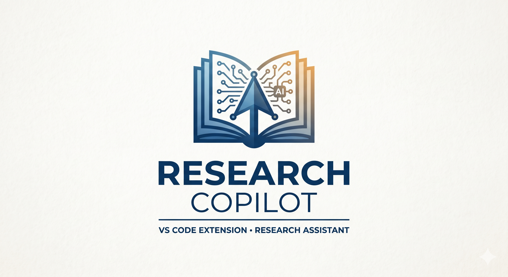

<p align="center">
  
</p>

<h1 align="center">Research Copilot</h1>

<p align="center">
  <strong>NotebookLM for VS Code — Transform PDF research into an AI-powered knowledge base</strong>
</p>

<p align="center">
  
  
  
  
  
</p>

<p align="center">
  <a href="#-features">Features</a> •
  <a href="#-installation">Installation</a> •
  <a href="#-quick-start">Quick Start</a> •
  <a href="#-commands-reference">Commands</a> •
  <a href="#-chat-commands">Chat</a> •
  <a href="#-configuration">Configuration</a>
</p>

---

## 📖 Overview

**Research Copilot** is a VS Code extension that transforms your research workflow. Index PDF documents, ask questions with AI-powered answers that cite sources with page numbers, generate knowledge graphs, create audio podcasts, and write full research papers with automatic citations — all without leaving your editor.

---

## ⚡ Built AI-Natively with Claude Code

This extension was designed and shipped using **Claude Code** as a core development tool — not as a code autocomplete, but as a collaborative engineering partner.

**The approach:**
- Architecture was designed collaboratively: service boundaries, data flow, and initialization order were reasoned through with Claude Code before a single file was written
- 14+ services were scaffolded and iterated rapidly — what would take weeks solo was compressed into days
- All local AI (ONNX embeddings, no API key required) was chosen deliberately for privacy and offline capability — Claude Code helped evaluate and integrate `@xenova/transformers` with the VS Code extension lifecycle
- Complex features like bounding-box PDF highlighting and hybrid TF-IDF + semantic search were implemented through tight human-AI iteration loops

**Why this matters:** AI-native development isn't about generating code blindly — it's about using AI as a force multiplier to ship ambitious features faster while keeping architectural judgment human. This project is a working example of that.

---

## ✨ Features

### 📍 **Per-Line Citations with PDF Highlighting** ⭐ NEW
Every answer comes with precise citations that you can click to jump to the exact location in the PDF:
- **Inline citations** like `[1, p.5]` for every claim
- **Clickable links** that open PDFs at the cited passage
- **Bounding box highlighting** around cited text in the PDF viewer
- Uses PDF coordinate extraction for pixel-accurate positioning

Use `/cited` command in chat to get fully-cited answers.

### 📊 **Temporal Knowledge Graph** ⭐ NEW
Visualize how research evolves over time:
- **Timeline view** showing publication years and citation flow
- **Citation chains** tracking how ideas propagate (Paper A 2018 → Paper B 2020 → Paper C 2022)
- **Influential paper detection** based on citation counts and temporal impact
- **Graph snapshots** at different points in time
- Filter by date range to see evolution of the field

### 📝 **Full Research Paper Generator** ⭐ NEW
Generate complete research papers with built-in academic templates:
- **IEEE Conference** format
- **Springer LNCS** (Lecture Notes in Computer Science)
- **ACM SIGCONF** format
- **APA Style** papers
- **Custom templates** — provide your own LaTeX template

Features:
- AI-generated content for each section (Abstract, Introduction, Methods, Results, Discussion)
- Automatic BibTeX bibliography from your sources
- Interactive UI panel for editing and customization
- Export to LaTeX (.tex) ready for submission

### 🎙️ **Audio Podcast Generation**
Transform your research papers into engaging audio podcasts! Choose from multiple styles:
- **Conversation**: Two hosts discussing the research naturally
- **Lecture**: Educational presentation style
- **Debate**: Friendly debate between different perspectives
- **Interview**: Q&A format with expert insights
- **Summary**: Brief audio overview of key findings

Uses Microsoft's free neural TTS with 12+ voice options — **no API keys required!**

### 🕸️ **Knowledge Graph Visualization**
See how your documents connect with an interactive D3.js visualization:
- Document nodes sized by content length
- Semantic similarity links between related papers
- Shared concept detection across documents
- Citation relationship mapping
- Drag, zoom, and explore your research landscape
- Export to JSON, GraphML, or GEXF (for Gephi/yEd)

### ✍️ **Research Writing Assistant**
AI-powered academic writing with automatic citations from your indexed documents:
- **Literature Reviews** — Synthesize sources on any topic
- **Abstracts** — Concise summaries of research
- **Introductions, Methodology, Discussion, Conclusions**
- **Custom sections** with your own prompts

**Output formats:**
- 📄 **LaTeX** (.tex) — Ready for academic submission
- 📚 **BibTeX** (.bib) — Auto-generated bibliography
- 📝 **Markdown** — With footnote citations

**Citation styles:** APA, MLA, Chicago, IEEE

### 📄 **Enhanced PDF Processing**
Converts PDFs to DOCX for superior extraction using [pdf2docx](https://github.com/ArtifexSoftware/pdf2docx):
- Better table recognition and formatting
- Cleaner image extraction
- Improved text layout preservation
- **Auto-setup**: Dependencies install automatically on first use

### 🔍 **Smart Document Search**
Search across all your research PDFs using natural language queries. Find relevant passages, citations, and information instantly.

### 🧠 **Semantic Search with AI Embeddings**
Powered by **all-MiniLM-L6-v2** from Hugging Face. Understands the *meaning* of your queries, not just keywords. Find conceptually related content even when exact words don't match.

### 🤖 **Copilot Integration**
Use `@research` in GitHub Copilot Chat to ask questions about your documents. Copilot searches your indexed PDFs and provides answers with citations.

### 📷 **Image Extraction & OCR**
Automatically extracts images from PDFs, including charts, diagrams, and figures. OCR support for scanned documents ensures no information is lost.

### 📑 **Citation Extraction**
Automatically detects and extracts academic citations in multiple formats:
- **APA**: (Author, Year)
- **MLA**: (Author Page)
- **IEEE**: [1], [2]
- **Harvard**: (Author Year)
- **Chicago/Vancouver**: And more!

Export your citations to **BibTeX** format for easy bibliography management.

### 🖍️ **Highlighting & Annotations**
Highlight important passages with color-coded markers:
- 🟡 Yellow, 🟢 Green, 🔵 Blue, 🩷 Pink, 🟣 Purple, 🟠 Orange

Add notes and tags to your highlights, then export them to Markdown or HTML.

### 📊 **Visual Dashboard**
Overview of all indexed documents, search interface, and research progress tracking.

### 🔗 **Language Model Tools**
Exposes your research to Copilot through 8+ Language Model Tools:
- `searchDocuments` — Keyword-based search
- `semanticSearch` — AI-powered semantic search
- `getDocumentContent` — Get full document text
- `getDocumentImages` — Retrieve images with OCR
- `listDocuments` — List indexed documents
- `summarizeDocument` — Get document summaries
- `getCitations` — Extract academic citations
- `getHighlights` — Retrieve user highlights

---

## 🚀 Installation

### From VS Code Marketplace
*(Coming soon)*

### From Source

```bash
# Clone the repository
git clone https://github.com/anant/research-copilot.git
cd research-copilot

# Install dependencies
npm install

# Compile TypeScript
npm run compile
```

Press `F5` in VS Code to launch the extension in a new Extension Development Host window.

### Requirements

- **VS Code** 1.85.0 or higher
- **GitHub Copilot** extension (for chat features)
- **Python 3.8+** (optional, for enhanced PDF conversion)
- **Node.js** 18+ (for development)

---

## 🏁 Quick Start

### Step 1: Index Your Documents

1. Open a workspace containing PDF files (research papers, textbooks, articles)
2. Open Command Palette (`Ctrl+Shift+P` / `Cmd+Shift+P`)
3. Run **`Research Copilot: Index All PDFs in Workspace`**

### Step 2: Build Semantic Search Index

Run **`Research Copilot: Build Semantic Search Index`** to enable AI-powered semantic search. This creates vector embeddings for meaning-based queries.

### Step 3: Start Researching!

| Task | How To |
|------|--------|
| 💬 Ask questions | Type `@research` in Copilot Chat |
| 📍 Get cited answers | Use `/cited your question` in chat |
| 🔍 Search documents | `Research Copilot: Search Documents` |
| 🕸️ View knowledge graph | `Research Copilot: Show Knowledge Graph` |
| 📊 Temporal graph | `Research Copilot: Show Temporal Knowledge Graph` |
| 🎙️ Generate podcast | `Research Copilot: Generate Audio Podcast` |
| 📝 Write paper | `Research Copilot: Generate Research Paper` |
| ✍️ Write sections | `Research Copilot: Write Research` |

---

## 💬 @research Chat Commands

The `@research` chat participant integrates with GitHub Copilot Chat. Use these commands:

| Command | Description |
|---------|-------------|
| `/cited [query]` | **⭐ NEW** Get answers with per-sentence citations and clickable PDF links |
| `/list` | Show all indexed documents |
| `/stats` | Display indexing statistics |
| `/summarize [doc]` | Get summary of a specific document |
| `/citations [doc]` | Extract citations from a document |
| `/highlights` | View all your highlights |
| `/semantic [query]` | Force semantic (AI) search |

### Examples

```
@research What methods were used in the Smith et al. paper?
@research /cited What are the main findings about neural networks?
@research /list
@research /summarize machine-learning-survey.pdf
@research /citations neural-networks.pdf
@research /semantic concepts similar to attention mechanisms
@research Compare the conclusions across my indexed papers
```

### Cited Answers

When you use `/cited`, each sentence in the response includes clickable citations:

```
The transformer architecture uses self-attention mechanisms [1, p.3].
This allows modeling long-range dependencies [1, p.5] [2, p.12].
```

Click any citation to open the PDF with the cited passage highlighted in a bounding box.

---

## ⚙️ Configuration

Access settings through `File > Preferences > Settings` and search for "Research Copilot".

### General Settings
| Setting | Default | Description |
|---------|---------|-------------|
| `autoIndex` | `true` | Auto-index PDFs when added to workspace |
| `indexPath` | `.research-copilot` | Folder to store index data |
| `maxPdfSizeMB` | `50` | Maximum PDF file size to process |

### PDF Processing
| Setting | Default | Description |
|---------|---------|-------------|
| `extractImages` | `true` | Extract images from PDFs |
| `ocrEnabled` | `true` | Enable OCR for scanned documents |
| `useDocxConversion` | `true` | Use enhanced DOCX conversion (requires Python) |
| `extractPositions` | `true` | Extract bounding box positions for citation highlighting |

### Search & Indexing
| Setting | Default | Description |
|---------|---------|-------------|
| `chunkSize` | `1000` | Text chunk size for indexing |
| `chunkOverlap` | `200` | Overlap between chunks |
| `embeddingModel` | `all-MiniLM-L6-v2` | Semantic embedding model |

### Paper Generation
| Setting | Default | Description |
|---------|---------|-------------|
| `defaultTemplate` | `ieee` | Default LaTeX template (ieee, springer, acm, apa) |
| `citationStyle` | `ieee` | Default citation style |
| `autoGenerateBibTeX` | `true` | Auto-generate BibTeX from sources |

---

## 🛠️ Commands Reference

Access all commands via Command Palette (`Ctrl+Shift+P` / `Cmd+Shift+P`).

### Core Commands
| Command | Description |
|---------|-------------|
| `Index All PDFs in Workspace` | Index all PDF files in the workspace |
| `Index This PDF` | Index a specific PDF file |
| `Open Dashboard` | Open the visual dashboard |
| `Clear Index` | Clear all indexed data |

### 📝 Research Paper Generation ⭐ NEW
| Command | Description |
|---------|-------------|
| `Generate Research Paper` | Open the paper generator UI with template selection |
| `Quick Generate Paper` | Command-line paper generation |

### 📊 Knowledge Graphs
| Command | Description |
|---------|-------------|
| `Show Knowledge Graph` | Interactive visualization of document connections |
| `Show Temporal Knowledge Graph` | **⭐ NEW** Time-aware graph showing citation evolution |
| `Export Knowledge Graph` | Export to JSON/GraphML/GEXF |

### 🎙️ Podcast & Media
| Command | Description |
|---------|-------------|
| `Generate Audio Podcast` | Create podcast from your documents |

### ✍️ Research Writing
| Command | Description |
|---------|-------------|
| `Write Research` | Generate literature reviews, abstracts, etc. with LaTeX |

### 🔍 Search Commands
| Command | Description |
|---------|-------------|
| `Search Documents` | Keyword search through documents |
| `Semantic Search` | AI-powered semantic search |
| `Hybrid Search` | Combines keywords + AI for best results |
| `Find Similar Passages` | Find text similar to selection |
| `Build Semantic Index` | Build/rebuild the AI search index |

### 🖍️ Highlighting Commands
| Command | Description |
|---------|-------------|
| `Create Highlight` | Highlight selected text with color |
| `View All Highlights` | Browse all your highlights |
| `Export Highlights` | Export to Markdown/HTML/JSON |

### 📑 Citation Commands
| Command | Description |
|---------|-------------|
| `Extract Citations` | Extract citations from a document |
| `Export BibTeX` | Export all citations as BibTeX |
| `Open Citation` | **⭐ NEW** Open PDF at citation with bounding box highlight |

---

## 📁 Project Structure

### Workspace Index Data
```
.research-copilot/              # Index data (created in your workspace)
├── index.json                  # Document metadata index
├── vectors.json                # Semantic embeddings
├── knowledge_graph.json        # Graph data
├── temporal_graph.json         # Temporal graph snapshots ⭐ NEW
├── extracted/                  # Extracted text as Markdown
├── converted/                  # DOCX conversions
├── podcasts/                   # Generated audio files
│   ├── podcast_123.mp3
│   └── podcast_123.md          # Transcript
├── writing/                    # Generated research writing
│   ├── literature_review.tex
│   ├── literature_review.bib
│   └── literature_review.md
├── papers/                     # Generated full papers ⭐ NEW
│   ├── paper_ieee.tex
│   └── paper_ieee.bib
└── images/                     # Extracted images
```

### Source Code Structure
```
src/
├── extension.ts                # Extension entry point
├── chat/
│   ├── researchParticipant.ts  # @research chat participant
│   └── toolProvider.ts         # Language Model Tools
├── services/
│   ├── documentStore.ts        # Document indexing & storage
│   ├── searchService.ts        # Keyword & semantic search
│   ├── embeddingService.ts     # AI embeddings (MiniLM)
│   ├── pdfIndexer.ts           # PDF text extraction
│   ├── pdfPositionService.ts   # PDF bounding box extraction ⭐ NEW
│   ├── pdfViewerService.ts     # PDF viewer with highlights ⭐ NEW
│   ├── citedAnswerGenerator.ts # Per-line citation generation ⭐ NEW
│   ├── temporalGraphService.ts # Time-aware knowledge graph ⭐ NEW
│   ├── templateManager.ts      # LaTeX template system ⭐ NEW
│   ├── knowledgeGraphService.ts# Knowledge graph construction
│   ├── podcastGenerator.ts     # Audio podcast generation
│   ├── researchWritingAssistant.ts # Research writing + papers
│   ├── citationExtractor.ts    # Citation parsing
│   ├── highlightService.ts     # Highlighting system
│   └── ...
├── views/
│   ├── dashboardPanel.ts       # Visual dashboard
│   ├── paperGeneratorPanel.ts  # Paper generation UI ⭐ NEW
│   └── documentTreeProvider.ts # Document tree view
└── types/
    └── declarations.d.ts       # TypeScript declarations

resources/
├── logo.png                    # Extension logo
└── templates/                  # LaTeX templates ⭐ NEW
    ├── ieee-conference.tex
    ├── springer-lncs.tex
    └── acm-sigconf.tex
```

---

## 🔧 How It Works

### Document Processing Pipeline

1. **PDF Processing**: Uses `pdf.js` or DOCX conversion for superior text extraction.

2. **Position Mapping**: Extracts bounding box coordinates `{x, y, width, height}` for each text block to enable PDF highlighting.

3. **Image Extraction**: Identifies and extracts embedded images via DOCX pipeline.

4. **OCR**: Uses `tesseract.js` for scanned documents and images.

5. **Text Chunking**: Splits documents into overlapping chunks for search accuracy, preserving position metadata.

6. **Semantic Embeddings**: Uses **Xenova/all-MiniLM-L6-v2** (384-dimensional) for meaning-based search.

### Knowledge Graph Construction

7. **Static Graph**: Analyzes concepts, citations, and semantic similarity to build document connections.

8. **Temporal Graph**: Extracts publication dates and citation relationships to model research evolution over time.

### Content Generation

9. **Cited Answer Generation**: Retrieves relevant chunks, generates answers via Copilot, maps each sentence to source citations with page numbers.

10. **Podcast Generation**: Uses VS Code's LM API for script generation + Microsoft edge-tts for audio.

11. **Research Writing**: Retrieves relevant chunks, generates content with Copilot, formats citations.

12. **Paper Generation**: Uses LaTeX templates (IEEE/Springer/ACM) with variable substitution and auto-generated BibTeX bibliographies.

---

## 🧠 The AI Model

Research Copilot uses **all-MiniLM-L6-v2** from Hugging Face:

| Property | Value |
|----------|-------|
| Architecture | MiniLM (distilled from BERT) |
| Embedding Dimension | 384 |
| Training Data | 1B+ sentence pairs |
| Size | ~23MB (quantized) |

The model runs locally via `@xenova/transformers` (ONNX runtime) — **your research stays private**.

---

## 🎬 Demo

> **5-minute walkthrough of the core workflow:**

**1. Index your papers**
```
Ctrl+Shift+P → "Research Copilot: Index All PDFs in Workspace"
```

**2. Ask a question with citations**
```
@research /cited What methods were used to improve transformer efficiency?
```
→ Returns cited answer with `[1, p.5]` inline links. Click any citation to jump to the exact passage, highlighted in the PDF.

**3. Visualize the knowledge graph**
```
Ctrl+Shift+P → "Research Copilot: Show Knowledge Graph"
```
→ Interactive D3.js graph showing semantic connections and citation chains across papers.

**4. Generate a research paper**
```
Ctrl+Shift+P → "Research Copilot: Generate Research Paper"
```
→ Select IEEE/Springer/ACM template, get LaTeX + BibTeX auto-populated from your indexed sources.

---

## 🎯 Use Cases

| Use Case | Features |
|----------|----------|
| **Academic Research** | Search papers, `/cited` answers, visualize connections |
| **Thesis Writing** | Auto-citations, BibTeX export, LaTeX output, paper generator |
| **Study Aid** | Audio summaries, semantic search |
| **Literature Review** | Synthesize multiple papers, temporal graph for field evolution |
| **Conference Prep** | Generate podcast summaries, IEEE/Springer paper templates |
| **Lab Meetings** | Knowledge graphs to show research landscape |

---

## 📝 Roadmap

- [x] ~~Vector embeddings for semantic search~~ ✅
- [x] ~~Citation extraction and linking~~ ✅
- [x] ~~Annotation and highlighting support~~ ✅
- [x] ~~Export to BibTeX~~ ✅
- [x] ~~Knowledge graph visualization~~ ✅
- [x] ~~Audio podcast generation~~ ✅
- [x] ~~Research writing assistant~~ ✅
- [x] ~~LaTeX export~~ ✅
- [x] ~~Per-line citations with PDF highlighting~~ ✅ **NEW!**
- [x] ~~Temporal knowledge graph~~ ✅ **NEW!**
- [x] ~~Full paper generator with templates~~ ✅ **NEW!**
- [x] ~~PDF bounding box citation viewer~~ ✅ **NEW!**
- [ ] Flashcard generation
- [ ] Integration with Zotero/Mendeley
- [ ] Collaborative research workspaces
- [ ] Video summary generation
- [ ] Multi-language support
- [ ] Real-time collaboration

---

## 📐 LaTeX Template Gallery

Research Copilot includes built-in templates for major academic formats:

### IEEE Conference (`ieee`)
Standard IEEE two-column conference format. Suitable for:
- IEEE conferences and symposiums
- Technical papers and proceedings

### Springer LNCS (`springer`)
Springer Lecture Notes in Computer Science format. Suitable for:
- Springer conference proceedings
- LNCS book chapters

### ACM SIGCONF (`acm`)
ACM Conference Proceedings format. Suitable for:
- ACM conferences (SIGCHI, SIGMOD, etc.)
- Computing research papers

### APA Style (`apa`)
American Psychological Association format. Suitable for:
- Social sciences research
- Psychology and education papers

### Custom Templates
Add your own LaTeX templates:
1. Place `.tex` file in `resources/templates/`
2. Use placeholders: `{{TITLE}}`, `{{AUTHOR}}`, `{{ABSTRACT}}`, `{{CONTENT}}`, `{{BIBLIOGRAPHY}}`
3. Select "Custom" in the paper generator UI

---

## 🤝 Contributing

Contributions are welcome!

1. Fork the repository
2. Create your feature branch (`git checkout -b feature/amazing-feature`)
3. Commit your changes (`git commit -m 'Add amazing feature'`)
4. Push to the branch (`git push origin feature/amazing-feature`)
5. Open a Pull Request

---

## 📄 License

This project is licensed under the MIT License - see the [LICENSE](LICENSE) file for details.

---

## 🙏 Acknowledgments

- [pdf2docx](https://github.com/ArtifexSoftware/pdf2docx) - PDF to DOCX conversion
- [edge-tts](https://github.com/rany2/edge-tts) - Microsoft neural TTS
- [D3.js](https://d3js.org/) - Knowledge graph visualization
- [PDF.js](https://mozilla.github.io/pdf.js/) - PDF rendering
- [Tesseract.js](https://tesseract.projectnaptha.com/) - OCR
- [Hugging Face Transformers](https://huggingface.co/) - AI embeddings
- [VS Code Extension API](https://code.visualstudio.com/api)
- Inspired by [Google NotebookLM](https://notebooklm.google.com/)

---

<p align="center">
  <strong>Made with ❤️ for researchers everywhere</strong><br>
  <em>Podcasts • Knowledge Graphs • Cited Answers • Paper Generation</em> 🎙️🕸️📍📝
</p>
